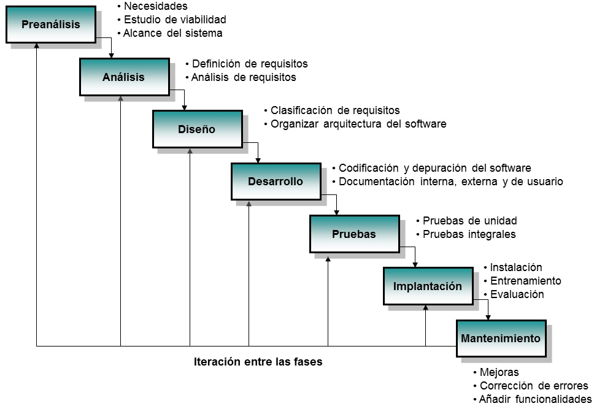

# PRACTICA 1

## 1. **¿Qué es un programa informático?**

Por definición, un programa informático es una secuencia de instrucciones u órdenes basadas en un lenguaje de programación que un ordenador o computadora interpreta para resolver un problema o ejecutar una función previamente definida.

## 2. **¿Cuál es la diferencia entre código fuente, código objeto y código ejecutable?**

* Código fuente es el conjunto de instrucciones escritas con un lenguaje de programación.
* Código objeto es el resultado de traducir el código fuente a un formato binario intermedio mediante un compilador (es decir, ceros y unos).
* Código ejecutable es el producto final del código, listo para funcionar. Está formado por uno o más códigos objeto.

## 3. **Cuáles son las etapas del desarrollo de software?**

El desarrollo de software pasa por las siguientes etapas:

- Planificación: Se definen objetivos, recursos y plazos del proyecto entre otros aspectos.

- Análisis: Se recopilan y se estudian detalladamente las necesidades del usuario y del cliente para saber que debe hacer el sistema.

- Diseño: Se planifica la arquitectura técnica, la interfaz, la base de datos y como se va a organizar los componentes del software.

- Desarrollo: Se escribe el código fuente para convertir los diseños en un producto funcional.

- Pruebas o testing: Se revisa el software a fondo para encontrar y corregir errores.

- Implementación o despliegue: Se lanza o se instala el sistema y se pone en marcha el entorno real para que los usuarios finales empiecen a utilizarlo.

- Mantenimiento: Fase continua donde se actualiza el programa, se corrigen fallos nuevos y se añaden mejoras con el tiempo.

### Enlace al repositorio

https://github.com/miguelaroca97/1DAMV\_ArocaRodriguez\_MiguelAngel

#### FUENTES CONSULTADAS

* https://www.lenovo.com/es/es/glossary/computer-programs/?srsltid=AU7gw4U6oP6s4kwzGSUTilEcuDl0Swkx41AnOjtHQHR\_Zhn8GdYkfnf7
* https://www.microsoft.com/es-es/power-platform/topics/phases-of-the-software-development-lifecycle
* https://www.studocu.com/es/document/instituto-de-educacion-secundaria-poligono-sur/matematicas-ii/13codigos-fuente-objeto-y-ejecutable/104853597?sid=aec8be2f-dcbe-455d-826c-cca8e176f80b1789559060

